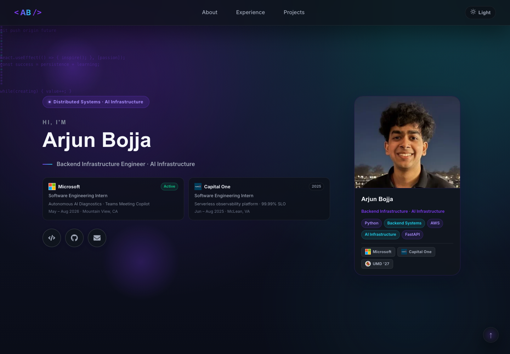

# Arjun Bojja | Engineering Portfolio

A full-stack portfolio for presenting my software engineering experience, projects, education, and technical focus. I built the interface with React and TypeScript, keep its primary content behind Python APIs, and deploy the public site through Firebase Hosting and Firebase Functions.

[](https://arjun-bojja-portfolio.web.app)


## Screenshot and Live Demo

**Live site:** [arjun-bojja-portfolio.web.app](https://arjun-bojja-portfolio.web.app)



The home page introduces my engineering focus and experience. Scrolling reveals skills, education, a professional timeline, and project links.

## What This Demonstrates

- A typed React UI composed from API-provided portfolio records
- Parallel requests, a five-minute browser cache, and explicit UI states
- Responsive navigation, persisted light and dark themes, smooth scrolling, and motion-based transitions
- Two Python delivery models for one domain: local FastAPI and deployed HTTP Firebase Functions
- FastAPI content reloads with fallback data for load failures
- SMTP contact endpoints with request validation and delivery-failure handling
- Firebase, Nginx, Docker, and Docker Compose deployment configuration
- Search, social preview, and structured metadata

---

## Architecture

```text
Production

Browser --> Firebase Hosting --> React + TypeScript
                                      |
                                      | parallel HTTPS GET requests
                                      v
                              Firebase HTTP Functions
                              profile | experience | projects

Local development

Browser :3000 --> React + TypeScript --> FastAPI :8000
                                            |
                                            +--> backend/data.py
                                            +--> Pydantic validation
                                            +--> optional SMTP
```

`NODE_ENV` selects the path. Development uses `http://localhost:8000/api`; production uses three Cloud Run URLs in `App.tsx`. Local and Firebase content are separate.

## Component and Service Responsibilities

| Area | Responsibility |
| --- | --- |
| `App.tsx` | Endpoints, data loading, cache, theme, and error boundaries |
| `Navbar.tsx` | Responsive navigation, section tracking, theme, and scrolling |
| `Hero.tsx` | Introduction, portrait, experience summary, and actions |
| `About.tsx` | Biography, skills, education, and specializations |
| `Experience.tsx` | Timeline, metrics, summary, skeleton, and empty state |
| `Projects.tsx` | Featured and standard project cards |
| `LoadingComponents.tsx` | Spinner, skeletons, errors, and retries |
| `Footer.tsx` | Social links, context, labels, and year |
| `Contact.tsx` | Validated contact form client; it exists but is not mounted by `App.tsx` |
| FastAPI | Local content, contact, diagnostics, validation, and logging |
| Firebase Functions | Production content, health, and contact handlers |
| Firebase Hosting / Nginx | Static delivery and single-page application fallback |

## Tech Stack

| Area | Technologies |
| --- | --- |
| Frontend | React 19, TypeScript 4.9, Create React App, Axios |
| UI | Framer Motion, React Icons, React Spring, Three.js, CSS |
| Local API | Python, FastAPI, Uvicorn, Pydantic, python-dotenv |
| Email | aiosmtplib locally, Python `smtplib` in Firebase Functions |
| Serverless | Firebase Functions for Python, Firebase Admin |
| Delivery | Firebase Hosting, Nginx, Docker, Docker Compose |
| Testing | Jest, React Testing Library, jest-dom |

## Prerequisites

- Node.js 18 and npm. Both frontend Dockerfiles use Node 18.
- Python 3.13 and `venv`. The backend image and Firebase runtime use Python 3.13.
- Git
- Optional: Firebase CLI, Docker with Compose, and SMTP credentials

## Exact Local Setup

```bash
git clone https://github.com/arjunbojja1/Portfolio.git
cd Portfolio

cd backend
python3 -m venv venv
source venv/bin/activate
python -m pip install -r requirements.txt
cd ../frontend
npm install
cd ..
```

Start FastAPI in terminal one:

```bash
cd backend
source venv/bin/activate
DEBUG=True python main.py
```

Start React in terminal two:

```bash
cd frontend
npm start
```

Open [http://localhost:3000](http://localhost:3000). FastAPI runs on port 8000, with debug docs at `/docs`.

### Optional contact configuration

Create `backend/.env` only to call the local contact endpoint:

```dotenv
DEBUG=True
SMTP_HOST=smtp.gmail.com
SMTP_PORT=587
SMTP_USERNAME=your-smtp-username
SMTP_PASSWORD=your-smtp-password
SMTP_FROM_EMAIL=your-sender@example.com
SMTP_TO_EMAIL=your-destination@example.com
```

The file is ignored by Git. Content endpoints do not need SMTP values.

## Site Walkthrough

1. **Home** presents identity, experience summaries, portrait, and action links.
2. **About** maps the biography, skills, education, awards, coursework, and focus cards.
3. **Professional Journey** turns experience into a timeline; optional `metrics` become chips.
4. **Projects** promotes the first `featured` object and renders the rest as compact cards. Links appear only when supplied.
5. **Navigation and theme** adapt to desktop and mobile. The saved theme or browser preference determines appearance.
6. **Footer** links to LinkedIn and GitHub. A scroll-to-top control appears after 300 pixels.

`Contact.tsx` and both server contact handlers exist, but the current page does not render the form. Its visible contact actions use `mailto:`.

## Content and Data Flow

1. `App` applies the saved theme and checks `portfolio_data_v2` in `localStorage`.
2. A cache younger than five minutes renders without a request.
3. On a miss, Axios requests profile, experience, and projects together with `Promise.all`.
4. All responses must succeed before the result is cached and copied into state.
5. Typed props map the data into sections.
6. Development calls the same loader every 30 seconds, but the five-minute cache still applies.
7. FastAPI reloads `backend/data.py`; Firebase returns data embedded in `functions/main.py`.

## API Reference

### Local FastAPI

Base URL: `http://localhost:8000`

| Method | Path | Purpose |
| --- | --- | --- |
| `GET` | `/api/profile` | Profile, skills, education, and social data |
| `GET` | `/api/experience` | Professional experience list |
| `GET` | `/api/projects` | Project descriptions, links, and technologies |
| `POST` | `/api/contact` | Validate fields and attempt SMTP delivery |
| `GET` | `/api/health` | Status, configuration, version, and counts |
| `GET` | `/api/metrics` | Environment, data, and configuration metadata |
| `POST` | `/api/reload` | Reload the data module and return content counts |
| `GET` | `/docs` | Swagger UI when `DEBUG=True` |

Contact request:

```json
{
  "name": "Example Visitor",
  "email": "visitor@example.com",
  "message": "Hello from the portfolio."
}
```

Pydantic validates email. Missing required SMTP values or delivery failures produce HTTP 500.

### Firebase HTTP Functions

| Method | Path / handler | Purpose |
| --- | --- | --- |
| `GET` | `/` on `get_profile` | Production profile and education data |
| `GET` | `/` on `get_experience` | Production experience data |
| `GET` | `/` on `get_projects` | Production project data |
| `GET` | `/` on `health_check` | Status, timestamp, counts, and email flag |
| `POST` | `/` on `contact_form` | Basic validation and SMTP delivery |

Each function has its own host, not an `/api` prefix. Handlers use 256 MB, a 60-second timeout, CORS, and a global 10-instance cap.

## Caching and Error Behavior

- `localStorage` holds one combined payload for five minutes. Valid data prevents a request; there is no stale-while-revalidate path.
- `Promise.all` makes loading and caching all-or-nothing. Changing `portfolio_data_v2` versions the cache.
- Invalid cached JSON follows the full-page network error path.
- Firebase caches JavaScript and CSS for one year. Nginx gives common static assets a one-year public, immutable policy.
- Initial loading uses a spinner. A 404 gets a backend message; other failures get a connection message and retry.
- Top-level and per-section error boundaries isolate render failures. Empty experience and project arrays have retry states.
- FastAPI load failures return a fallback profile and empty lists, so health may still report success.
- The Firebase contact handler returns a received message if email fails; FastAPI returns HTTP 500.

## Deployment Options

### Firebase

The configured project is `arjun-bojja-portfolio`. After installing and authenticating the Firebase CLI:

```bash
npm run firebase:deploy
npm run firebase:deploy:functions
npm run firebase:deploy:hosting
```

The full deploy builds first. Hosting publishes `frontend/build` and rewrites unknown routes to `index.html`.

### Nginx frontend container

```bash
docker build -t arjun-portfolio .
docker run --rm -p 3000:3000 arjun-portfolio
```

Nginx serves the React build. It calls fixed Firebase URLs; the configured `REACT_APP_API_URL` and `REACT_APP_API_BASE_URL` values are unused.

### FastAPI container

```bash
docker build -t arjun-portfolio-api backend
docker run --rm -p 8000:8000 arjun-portfolio-api
```

Compose describes three services, but frontend and backend currently depend on each other. Remove that cycle before startup. The production frontend still targets Firebase unless rebuilt with changed endpoint logic.

## Build and Test Commands

```bash
cd frontend
npm run build
npm test -- --watchAll=false
```

The only checked-in test is the CRA placeholder. It searches for "learn react", which is absent, so it is not a passing regression test. There are no backend tests, coverage threshold, CI workflow, or benchmarks.

With FastAPI running, smoke-test its read endpoints:

```bash
curl http://localhost:8000/api/health
curl http://localhost:8000/api/profile
curl http://localhost:8000/api/experience
curl http://localhost:8000/api/projects
```

## Configuration and Operational Boundaries

| Setting | Behavior |
| --- | --- |
| `DEBUG` | Enables FastAPI docs, reload mode, and debug labeling |
| `SMTP_HOST`, `SMTP_PORT` | Local SMTP server; defaults to Gmail on 587 |
| `SMTP_USERNAME`, `SMTP_PASSWORD` | Required for local contact delivery |
| `SMTP_FROM_EMAIL`, `SMTP_TO_EMAIL` | Set the local sender and destination |
| `NODE_ENV` | Selects local FastAPI or fixed production URLs |
| `REACT_APP_API_BASE_URL` | Present in `.env.production` but unused by `App.tsx` |

- Portfolio content is Python source data, not a database or CMS.
- Local and Firebase content can drift independently.
- FastAPI CORS permits localhost ports 3000 and 3001. Firebase handlers use wildcard origins.
- Local API routes have no authentication. Request metadata and contact sender identity are logged.
- Browser caching is per profile. Functions are otherwise stateless.
- Fonts, company logos, the university seal, and external links require third-party network access.
- The rendered application requires JavaScript.

## Project Structure

```text
Portfolio/
|-- README.md
|-- package.json                 # Root scripts
|-- firebase.json                # Hosting and Functions
|-- .firebaserc
|-- Dockerfile                  # React and Nginx image
|-- Dockerfile.dev              # React development image
|-- docker-compose.yml
|-- nginx.conf
|-- backend/
|   |-- main.py                 # FastAPI and SMTP
|   |-- data.py                 # Local portfolio content
|   |-- requirements.txt
|   `-- Dockerfile
|-- functions/
|   |-- main.py                 # Firebase handlers and content
|   `-- requirements.txt
|-- frontend/
|   |-- package.json
|   |-- tsconfig.json
|   |-- .env.production
|   |-- public/
|   |   |-- index.html
|   |   |-- llms.txt
|   |   |-- headshot.png
|   |   |-- headshot.webp
|   |   `-- Arjun_Bojja_Resume.pdf
|   `-- src/
|       |-- index.tsx
|       |-- App.tsx             # Data, cache, theme
|       |-- App.css
|       |-- index.css
|       |-- App.test.tsx
|       `-- components/
|           |-- Navbar.tsx
|           |-- Hero.tsx
|           |-- About.tsx
|           |-- Experience.tsx
|           |-- Projects.tsx
|           |-- Contact.tsx
|           |-- Footer.tsx
|           `-- LoadingComponents.tsx
|-- docs/
|   |-- screenshots/portfolio-home.png
|   `-- superpowers/
`-- scripts/start-dev.sh
```
